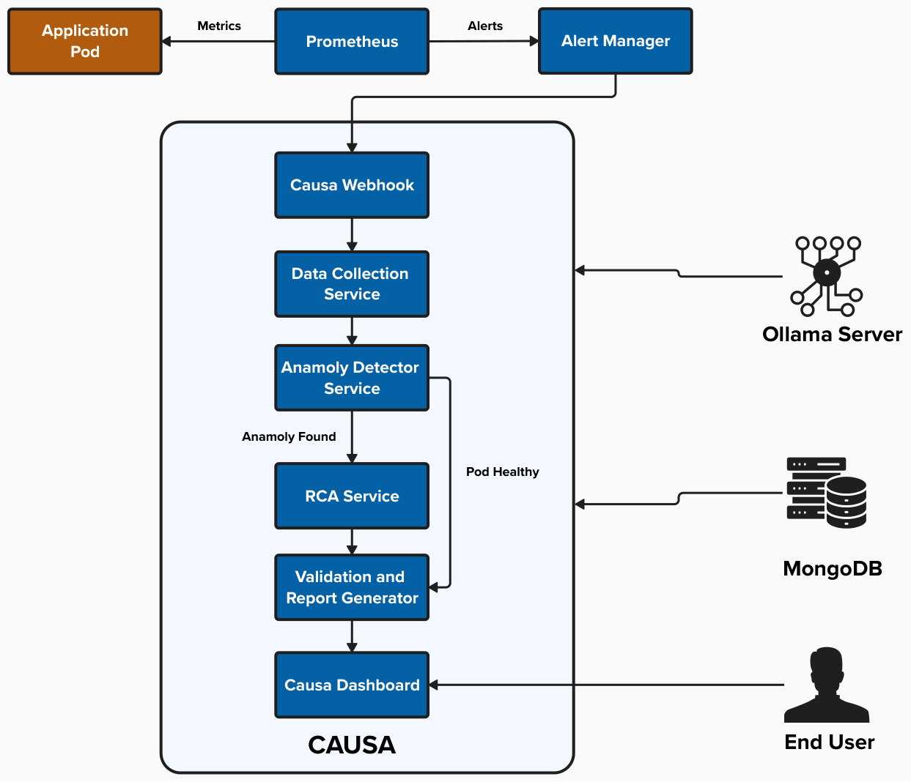
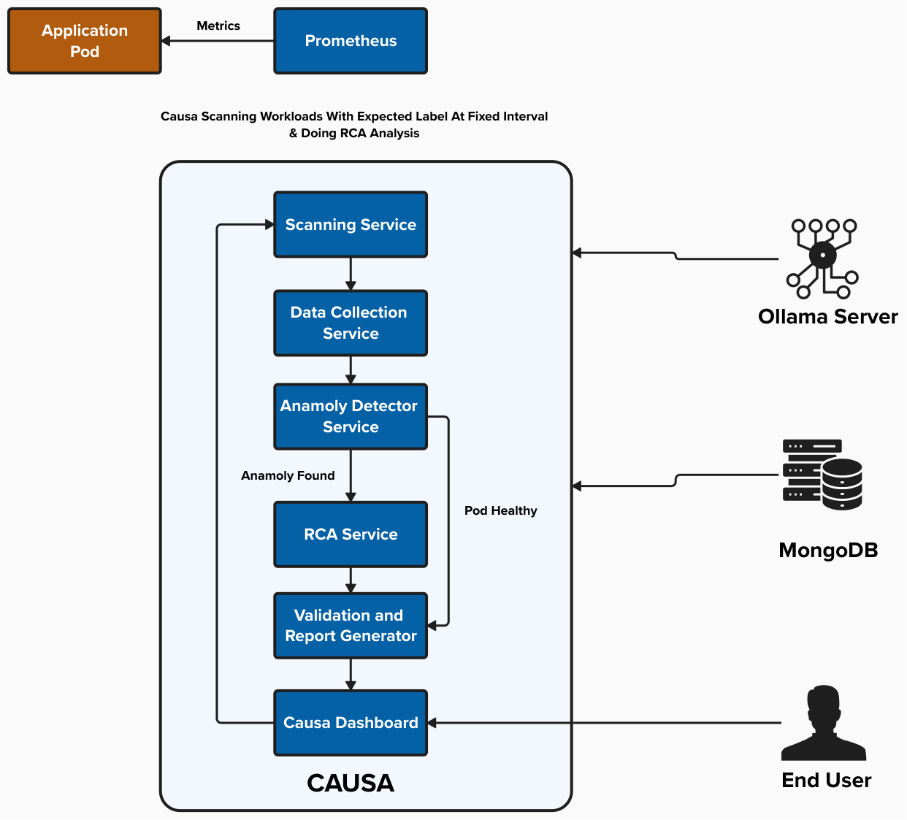

# Architecture

Causa RCA is built with a modular, cloud-native architecture designed for Kubernetes environments. The system uses multiple AI agents orchestrated through a pipeline to provide comprehensive root cause analysis.

---

## Architecture Diagrams

### Alert-Driven Mode Architecture



The alert-driven mode architecture shows how Causa responds to Prometheus alerts in real-time, triggering analysis only when issues are detected.

### Scanning Mode Architecture



The scanning mode architecture illustrates the proactive monitoring approach, where Causa continuously scans labeled workloads at configured intervals.

---

## Core Components

### 1. Lifecycle Management

**StartupService**
- Initializes the application on startup
- Validates configuration
- Sets up mode-specific services

**LifecycleService** (MONITORING mode)
- Manages scheduled scanning tasks
- Configurable scan intervals
- Coordinates with ScannerService

**WebhookManagerService** (ALERT_DRIVEN mode)
- Processes incoming Prometheus alerts
- Validates alert payloads
- Triggers analysis for affected pods

### 2. Data Collection Layer

**PrometheusClient**
- Queries Prometheus for metrics
- Retrieves CPU, memory, and resource usage
- Fetches historical data for analysis

**Kubernetes API Integration**
- Retrieves pod status and events
- Collects container logs (current and previous)
- Accesses pod metadata and labels

**CryostatClient** (Optional)
- Connects to Cryostat for JFR profiling
- Retrieves Java Flight Recorder data
- Provides deep JVM insights

**DataCollectorService**
- Orchestrates all data collection
- Aggregates data from multiple sources
- Formats data for AI analysis

### 3. AI Analysis Pipeline

The analysis pipeline uses three specialized AI agents powered by Ollama:

**Agent 1: Anomaly Detector**
- **Purpose**: Classify the type of issue
- **Input**: Metrics, logs, events
- **Output**: Anomaly type (e.g., JVM_OOM_LEAK, CPU_THROTTLING, HEALTHY)

**Agent 2: Root Cause Analyst**
- **Purpose**: Perform deep analysis and propose solutions
- **Input**: Anomaly type + full context + RAG knowledge
- **Output**: Detailed root cause analysis and fix recommendations
- **Enhancement**: RAG (Retrieval-Augmented Generation) with knowledge base

**Agent 3: Validation Agent**
- **Purpose**: Critique findings and format output
- **Input**: RCA output + original context
- **Output**: Validated, structured JSON report

### 4. Storage & API Layer

**MongoDB**
- Stores analysis sessions and reports
- Maintains historical data
- Enables trend analysis

**REST API**
- `/rca/analyze` - Manual analysis endpoint
- `/rca/webhook` - Alert webhook endpoint
- `/dashboard` - Web UI

**Dashboard**
- Web-based UI for viewing results
- Filtering and search capabilities
- Detailed report visualization

---

## Data Flow

### MONITORING Mode Flow

```
1. LifecycleService triggers scan
   ↓
2. ScannerService finds labeled pods
   ↓
3. For each pod:
   ├─ DataCollectorService gathers data
   ├─ RcaOrchestrator runs AI pipeline
   └─ Results stored in MongoDB
   ↓
4. Wait for next scan interval
```

### ALERT_DRIVEN Mode Flow

```
1. Prometheus fires alert
   ↓
2. Alertmanager sends webhook to Causa
   ↓
3. WebhookManagerService validates alert
   ↓
4. For each valid alert:
   ├─ Extract namespace and pod
   ├─ DataCollectorService gathers data
   ├─ RcaOrchestrator runs AI pipeline
   └─ Results stored in MongoDB
   ↓
5. Return webhook response
```

---

## Technology Stack

### Framework
- **Quarkus** - Cloud-native Java framework
- **Maven** - Build and dependency management

### AI & ML
- **LangChain4j** - AI orchestration framework
- **Ollama** - Local AI model inference
- **RAG** - Retrieval-Augmented Generation

### Storage
- **MongoDB** - Document database for analysis storage
- **Embedded Knowledge Base** - Runbooks and documentation

### Kubernetes Integration
- **Fabric8 Kubernetes Client** - K8s API interaction
- **REST Client** - Prometheus and Cryostat integration

### Monitoring
- **Prometheus** - Metrics collection
- **Alertmanager** - Alert routing

---

## Extensibility

### Custom AI Models
- Configurable model IDs per agent
- Support for different Ollama models

---

[← Back to Home](index.html) | [Next: Features →](features.html)